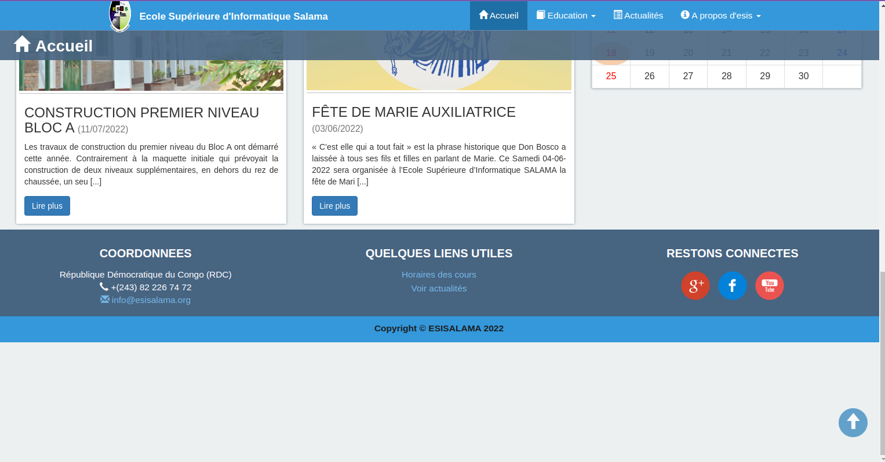
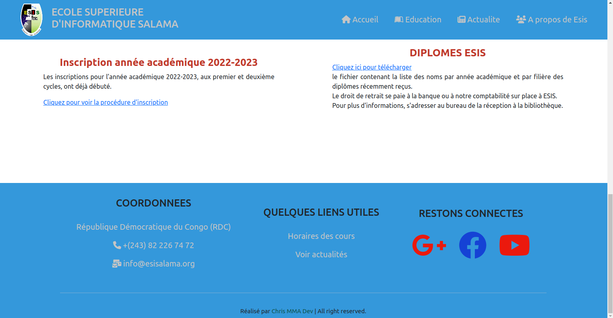
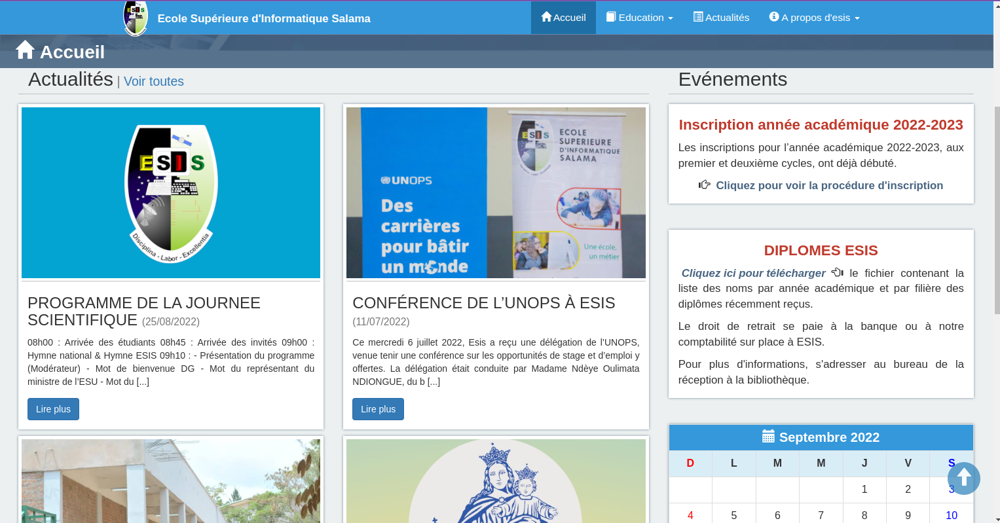
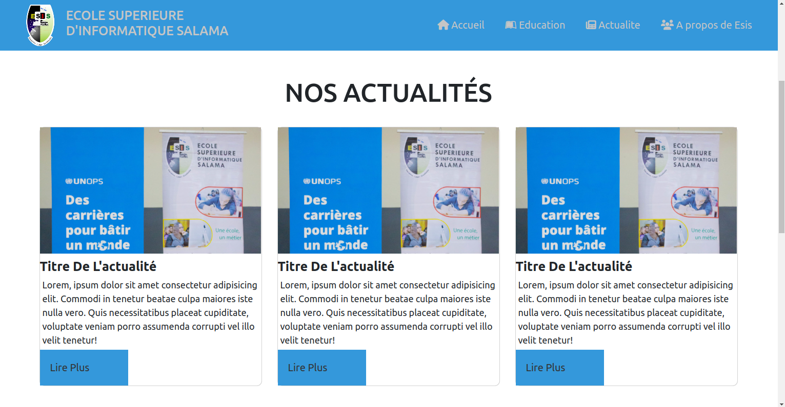

# Projet proposition du design pour le site de l'ecole superieure d'informatique salama
Projet de développement web consistant a proposer un design pour le site de l’école supérieure d'informatique salama

## LISTE DES OUTILS UTILISES POUR LA REALISATION DE CE TRAVAIL

1 HTML
2 CSS
3 JAVASCRIPT
4 BOOTSTRAP (css et js)

## DIFICULTES RENCONTREES

Nous avons rencontrer les difficultees suivantes
### Certains membres du groupe n'avez pas des PC et d'autres ont boyicotte le travail

### Le temps du travail
Nous avons eu peu des tems pour ce travail ce qui ne nous a pas permis de bien le faire et aussi parce que nous preparions en meme temps nos examens de second semestre

## Les point forts de notre proposition

Nous avons utilises des outils (technologies) recents

## Les points faibles du site du site existant
pour ce qui est des points faibles nous en avons trouves quelques-uns qui sont :

### le positionnement du footer

Comme vous pouvez le voir, le footer du site existant n'est pas bien positionne.
Normalement le footer doit rester coller au bas de l'ecran mais le footer du site existant monte aussi au scroll

#### solution 

Nous avons proposes un footer qui reste coller au bas de l'ecran meme au scroll 

### L'alignement des elements

Pour nous l'alignement des elements n'est pas beaux pour un site de l'ecole superieure d'informatique salama

### solution 

Pour solution nous avons proposes cet alignement 

# LISTE DES MEMBRES DU GROUPE GUIDO VAN ROSSUM

Nous n'avons mis que les gens qui ont montres de l'interet pour le travail les autres nous ne les avons pas vu pour le travail
### TSHILOBO TSHIAMA Marthinie
### KAFUTSH KASHAL Premice
### MUTOKE MUSULE Andres
### MI-SONG YAMBELA Linda
### PALUKU MUYUMBU Albert
### KINY NAZIRI Michael
### MUKEBA MUKEBA Chrinovic

# Orgnisation du groupe

### MUTOKE MUSULE Andres : Chef du groupe
### TSHILOBO TSHIAMA Marthinie : Chef du groupe Adjointe
### MI-SONG YAMBELA Linda : Rapporteuse

# Le site:
nous avons deployes notre projet sur netlify,
Si vous etes curieux cliquez<a href="https://propositiondesigneesis.netlify.app/"> ici</a>

En mode responsive nous avons mis le logo de esis comme boutons toogle sur lequel il faut cliquer pour voir le menu

# HISTOIRE DE GUIDO VAN ROSSUM

Van Rossum est né et a grandi en Hollande, où il a obtenu son diplôme en 1982. Il a ensuite travaillé pour de nombreux instituts de recherche, comme l'Institut national de recherche en mathématiques et informatique (CWI) et Institut national des normes et de la technologie (NIST). Il a collaboré à l'élaboration du langage de programmation abc, qui a beaucoup d'influence dans le développement de Python.

En 1996, lorsque la source Python était proche, Guido Van Rossum a écrit[2]:

« Il y a plus de six ans, en Décembre 1989, je cherchais un projet de programmation pour » passe-temps « que je dois tenir occupé la semaine près de Noël. Mon bureau ... serait fermé, mais j'avais un ordinateur, et pas beaucoup plus. J'ai décidé d'écrire un interprète pour un nouveau langage de script pour que je l'aurais pensé après: un descendant d'ABC qui aurait appartenu aux pirates Unix. J'ai choisi Python comme le nom du projet, étant légèrement irrévérencieux (et je suis un grand fan de Flying Circus Monty Python) "

Plus tard, en 2000, il a écrit à nouveau[3]:

« Prédécesseur de Python, ABC, a été inspiré par SETL - Lambert Meertens a passé une année avec le groupe SETL New-York avant de décider de la conception finale de ABC! »

### Programmation pour tout le monde

En 1999, Van Rossum a soumis une proposition à la DARPA appel Programmation informatique pour tout le monde (Annexe pour tous), dans lequel défini ses objectifs pour python:

Un langage simple, intuitif et puissant que ses principaux adversaires
Open source, afin que chacun puisse participer à son développement
Un code aisément compréhensible, comment l'anglais parlé
Grande pour les tâches quotidiennes, car il peut permettre des temps de développement plus courts
Un grand nombre de ces points ont déjà été faites. Python a grandi, devenant une langue populaire, en particulier dans l'environnement Internet.

Van Rossum en 2001 a remporté le prix pour la promotion du logiciel libre par Free Software Foundation (FSF) à la conférence FOSDEM à Bruxelles, en Belgique. en Décembre 2005, Il a été embauché comme Google[4]. Il a écrit un outil basé sur le Web pour contrôler le code Google en Python[5].

En Décembre 2012 Guido van Rossum a été embauché par Dropbox, service d'hébergement de fichiers basé sur le cloud, en grande partie développé par python